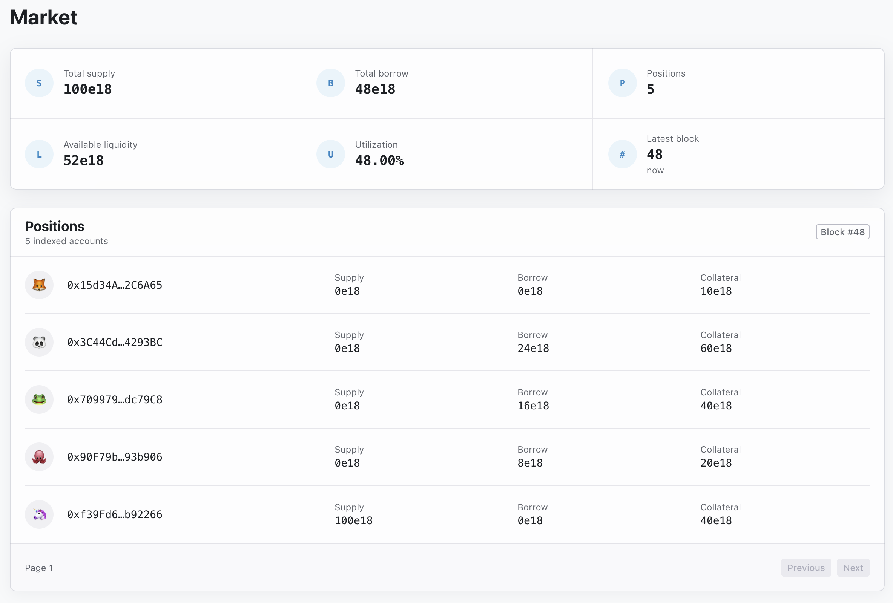

# smolpho

Smolpho is a small lending protocol inspired by Morpho Blue.
It combines Solidity contracts, an event-driven Go indexer, and a simple React webapp.



## Installation

Install these system prerequisites first:

- [Foundry](https://book.getfoundry.sh/) (`forge`, `cast`, and `anvil`)
- [Go](https://go.dev/doc/install)
- [Node.js and npm](https://nodejs.org/)
- [Task](https://taskfile.dev/installation/)
- [`jq`](https://jqlang.org/download/)

Then, from the repository root, install the project dependencies:

```sh
task install
```

Build the contracts, regenerate the ABI and Go bindings, and compile the
indexer with:

```sh
task build
```

Run all Solidity and Go tests with:

```sh
task test
```

## Demo

The local demo deploys Smolpho to a deterministic Anvil chain, indexes its
events into SQLite, and displays the resulting market and positions in Smolpho
Web. Run the following commands from the repository root in four terminals.

Terminal 1 — start a fresh local chain:

```sh
task demo:anvil
```

Terminal 2 — deploy the contracts, then start the indexer API:

```sh
task demo:deploy
task demo:api
```

Terminal 3 — start the web application:

```sh
task web:dev
```

Open [http://localhost:5173](http://localhost:5173) in a browser.

Terminal 4 — populate the market:

```sh
task demo:scenario
```

The scenario creates five positions from Anvil's deterministic accounts: one
supplier, three collateralized borrowers with different balances, and one
collateral-only account.
Smolpho Web updates as the indexer reconstructs each state change.

Alternatively, instead of web app, one may resort to CLI via `task demo:indexer`.

The demo requires a fresh chain because its deployment addresses are
deterministic. To run it again, stop Anvil, start `task demo:anvil` again, and
repeat the remaining commands. The mnemonic and private key in the Taskfile
are Anvil's public test credentials and must never be used on a real network.

## Documentation

- [Contracts](contracts/README.md)
- [Indexer](indexer/README.md)
- [Web application](web/README.md)
